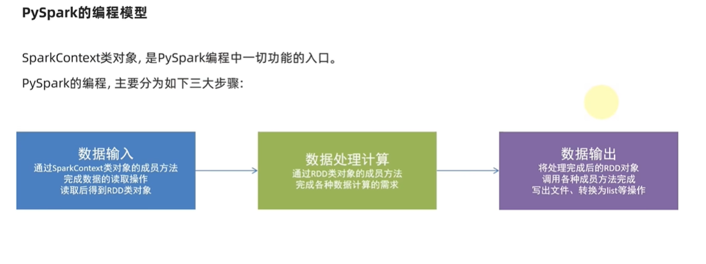

<!--
 * @Author: error: error: git config user.name & please set dead value or install git && error: git config user.email & please set dead value or install git & please set dead value or install git
 * @Date: 2023-12-06 18:52:19
 * @LastEditors: error: error: git config user.name & please set dead value or install git && error: git config user.email & please set dead value or install git & please set dead value or install git
 * @LastEditTime: 2023-12-07 18:43:22
 * @FilePath: \python-learn\大数据\README.md
 * @Description: 这是默认设置,请设置`customMade`, 打开koroFileHeader查看配置 进行设置: https://github.com/OBKoro1/koro1FileHeader/wiki/%E9%85%8D%E7%BD%AE
-->
# python-learn
# day 2023/11/29

## Hadoop是一个由Apache基金会所开发的分布式系统基础架构，主要解决海量数据的存储和海量数据的分析计算问题
    官网： https://dlcdn.apache.org/hadoop/common/hadoop-3.3.6/
    Hadoop1.0
        - HDFS 分布式文件存储系统
        - MapReduce 资源管理和分布式数据处理
    Hadoop2.0 
        - HDFS 分布式文件存储系统
        - MapReduce 分布式数据处理
        - YARM 集群资源管理、任务调度
    Hadoop3.0 
        - 性能优化

    hadoop 集群包含 ： HDFS集群和YARN集群

## apache spark 适用于大规模数据处理的统一分析引擎； 简单来说，spark是一款分布式的计算框架，用于调度成百上千的服务器集群，计算TB,PB,EB级别的海量数据 

https://spark-examples.readthedocs.io/en/latest/spark-rdd/spark-rdd-textFile.html

## 安装第三方库（需要依赖java环境）
    pip install pyspark

## 编程模型
    1. 数据输入
        通过sparkContext类对象的成员方法完成数据的读取操作，读取后得到RDD类对象
    2. 数据计算处理
        通过RDD类对象的成员方法完成各种数据算的需求
    3. 数据输出
        将处理完成后的EDD对象调用各种成员方法完成写出文件，转换为list等操作

## 数据容器转RDD对象
    pyspark支持通过sparkContext对象的parallelize成员方法，将 list [] ， tuple () , set , dict , str 对象转换为RDD对象
        * 字符串会被拆分成一个个的字符存入RDD对象，
        * 字典仅有key会被存入RDD对象

